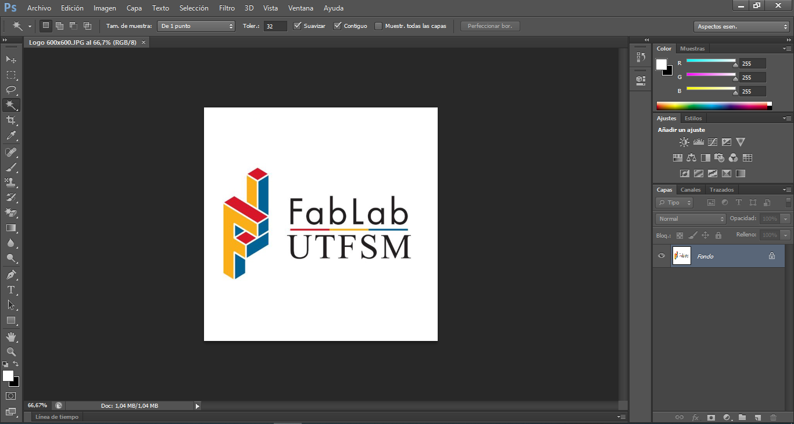
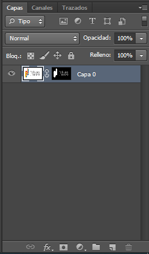
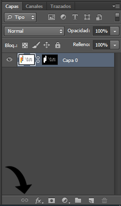
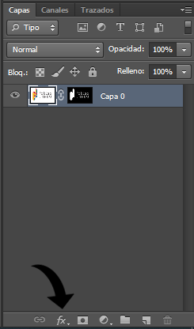
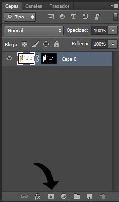
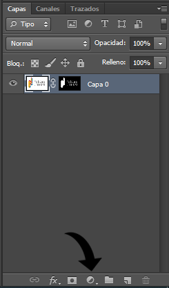
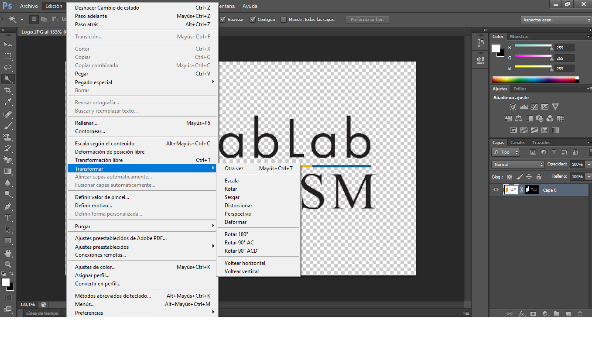

# Tutorial de Photoshop

_Adobe Photoshop es un editor de fotografías desarrollado por Adobe Systems Incorporated. Usado principalmente para el retoque de fotografías y gráficos. 
Este tutorial fue creado por ayudantes del FabLab y corresponde a un recopilatorio de herramientas empleadas para la creción y edición de infografías, esto con la finalidad de aportar en su desarrollo y aplicación de la herramienta."_

## Herramientas Básicas

_Como se puede observar al costado izquierdo y derecho de la imagen, se presentan un gran numero de herramientas que este software nos provee para la edicción de imagenes y que serán muy utiles a medida que nos adentramos al mundo de la edición de la fotografía y la creación de graficos en general, pero antes de entrar de lleno en estas herraminetas, será necesario saber como opera este programa y cuales son las grandes ventajas que este posee._

  

### Herramientas de Capa 

_Una de las grandes ventajas que tiene este software es la creación de capas y mascaras vectoriales, que nos permiten la superposición de imagenes, el movimiento de imagenes y corrección de los espacios "vacios", la creación de patrones, entre otros._

  

_La imagen anterior corresponde al panel de capas, en este panel se administra estas, determinando la posicion de ellas en la imagen, donde las capas que se encuentran superpuestas en el nivel superior de la imagen son las capas que aparecen primero_

_En la parte inferior de este panel aparecen las herranientas de capas, se presentan a continuación:_

_**Enlazar capas:** Nos permite crear dependencia entre las capas seleccionadas, es decir, los ajustes que se realicen a una de las capas se realizarán automáticamente a la capa ligada._

  

_**Estilo de capa:** Sirve para predefinir configuraciones y determinarlas como preestablecidos para modelos posteriores._

  

_**Mascara:** Corresponde a como dice su nombre una mascara, esta herramineta tiene como función ocultar las partes seleccionadas de la imagen, estando en negro las secciones a ocultar y en blanco lo que se muestra de la imagen._

  

_**Capa de relleno:**  su uso principal es para agregar fondos a las imagenes, pueden ser de colores uniformes o cualquiera en generla_

  

_Ya desarrolladas de forma introductoria las herramientas de capas se puede continuar con el desarrollo de las herramientas básicas del software y que corresponden a los iconos a la izquierda de la pantalla_

_**Mover:** esta herramienta actua para desplazar a la capa seleccionada de forma libre a traves del lienzo o a traves del programa, pudiendo desplazar imagenes desde una ventana a otra._

  

## Opreaciones utiles

### Quitar el fondo a una imagen

_A partir de la herramienta de selección introducida a lo largo de este tutorial, nos encontramos con una gran herramienta para la edición de fotografías y que es la._

