# Introdución al Photoshop

_Adobe Photoshop es un editor de fotografías desarrollado por Adobe Systems Incorporated, usado principalmente para el retoque de fotografías y gráficos. 
Este tutorial fue creado por ayudantes del FabLab y corresponde a un recopilatorio de herramientas empleadas para la creción y edición de infografías, esto con la finalidad de aportar en su desarrollo y aplicación de la herramienta."_

## Herramientas Básicas

_Como se puede observar al costado izquierdo y derecho de la imagen, se presentan un gran numero de herramientas que este software nos provee para la edicción de imágenes y que serán muy utiles a medida que nos adentramos al mundo de la edición fotográfica y la creación de gráficos en general, pero antes de entrar de lleno en estas herraminetas, será necesario saber como opera este programa y cuales son las grandes ventajas que este posee._

  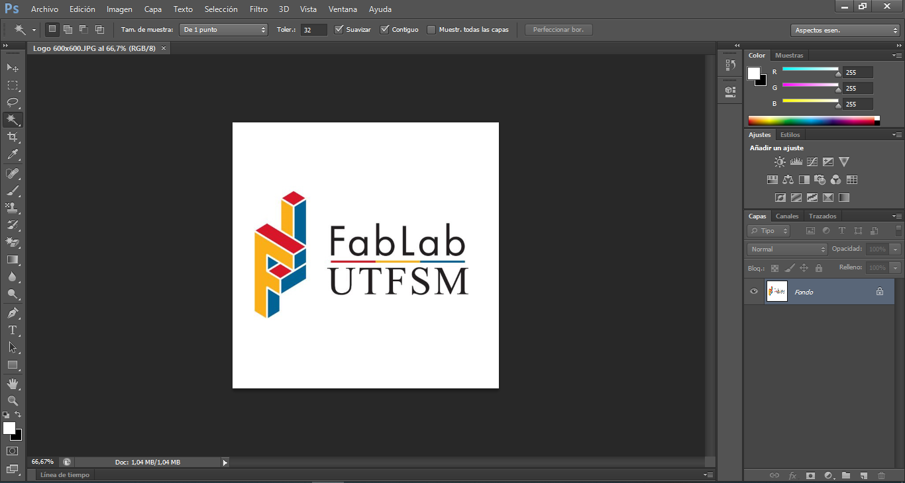

### Herramientas de Capa 

_Una de las grandes ventajas que tiene este software es la creación de capas y mascaras vectoriales, que nos permiten la superposición de imágenes, el movimiento de imágenes y corrección de los espacios "vacios", la creación de patrones, entre otros._

  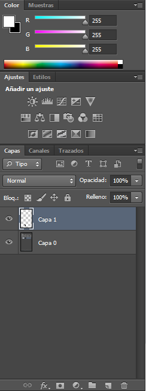

_La imagen anterior corresponde al panel de capas, en este panel se administran estas, determinando la posición de ellas en la imagen, donde las capas que se encuentran superpuestas en el nivel superior de la imagen son las capas que aparecen primero_

_En la parte inferior de este panel aparecen las herranientas de capas, que se presentan a continuación:_

_**Enlazar capas:** Nos permite crear dependencia entre las capas seleccionadas, es decir, los ajustes que se realicen a una de las capas se realizarán automáticamente a la o las capa ligadas._

  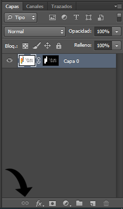

_**Estilo de capa:** Sirve para predefinir configuraciones y determinarlas como preestablecidas para modelos posteriores._

  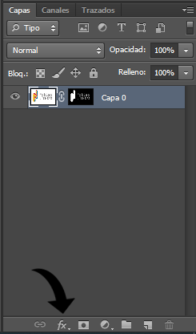

_**Mascara:** Corresponde a como dice su nombre una mascara, esta herramineta tiene como función ocultar las partes seleccionadas de la imagen, estando en negro las secciones a ocultar y en blanco lo que se muestra de la imagen._

  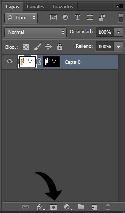

_**Capa de relleno:**  su uso principal es para agregar fondos a las imagenes, pueden ser de colores uniformes o cualquiera en general_

  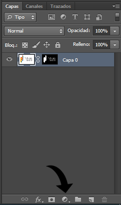

_Ya desarrolladas de forma introductoria las herramientas de capas se puede continuar con el desarrollo de las herramientas básicas del software y que corresponden a los iconos a la izquierda de la pantalla_

_**Mover:** esta herramienta actua para desplazar a la capa seleccionada de forma libre a traves del lienzo o a traves del programa, pudiendo desplazar imágenes desde una ventana a otra._

  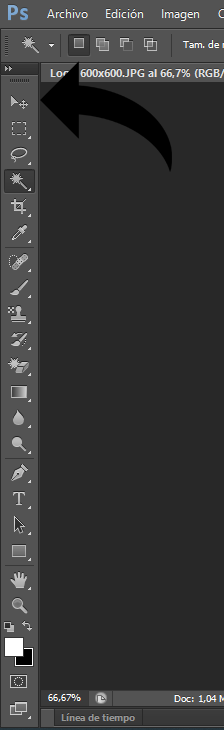

_Dentro de su panel además nos permite alinear y centrar las imágenes._

  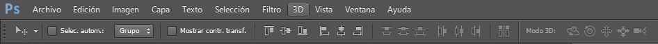
  
## Operaciones útiles

### Quitar el fondo a una imagen

_A partir de la herramienta de selección introducida a lo largo de este tutorial, nos encontramos con una gran herramienta para la edición de fotografías. Para quitar o cambiar el fondo de una imagen se recomienda el uso de imagenes con un alto contraste facilitando así la acción. En primer lugar se selecciona la herramienta de selección rápida como se observa en la imagen_

  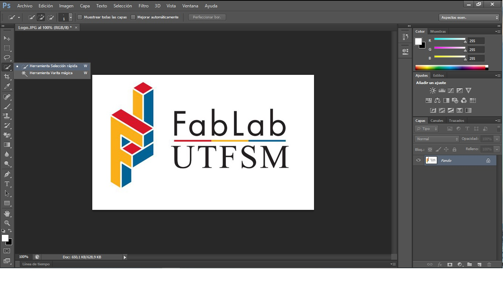

Luego cuidadosamente se debe seleccionar el borde de la imagen, siendo lo que esta al interior de la linea punteada los elementos que se consevan y los que están al exterior los que se eliminan. Como se observa en la imagen a continuación, las opciones de selección, se puede seleccionar como deseleccionar elementos, además de jugar con la opacidad del puntero, entre otros. 

  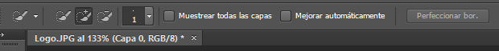

Como recomdendación al terminar la selección se debe crear una mascara, así el fondo en vez de elimitarse se escondera y en el caso de algún error a partir de la herramienta de pincel corregir sobre la mascara como se observa en la imagen a continuación.

  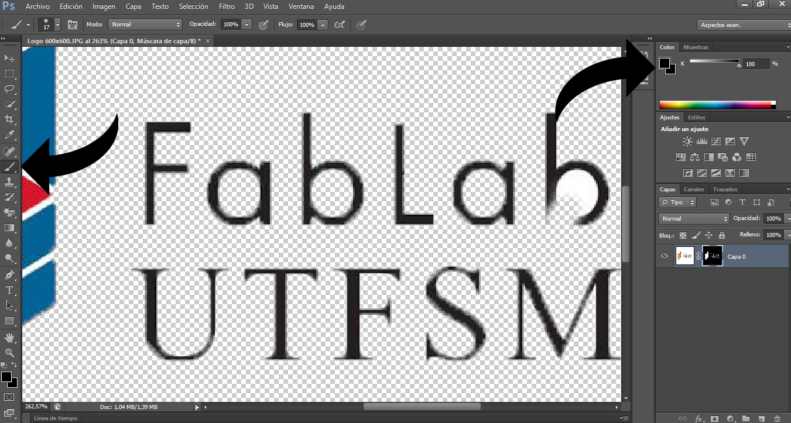

### Transformar

_La herramienta de transformar se encuentra en el menú desplegable al pinchar edición, esta herramienta nos sirve para modificar la forma de la imagen teniendo las funciones de escala, rotar, sesgar, distorsionar, perspectiva, deformar y voltear, muy utiles al momento de editar alguna imagen._

  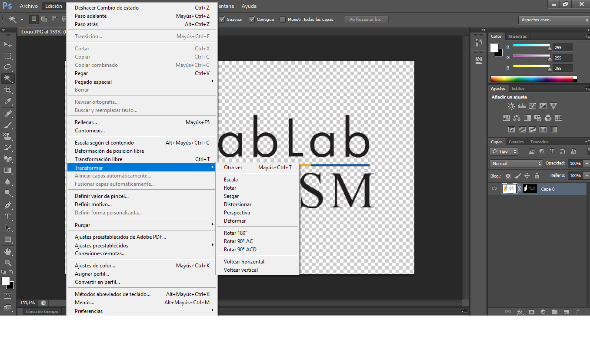

_Para el uso de esta herramienta tambien se puede usar el comando ctrl+T que nos permite modificar la estructura de la imagen, con menos opciones que en la anterior, agregando que el mantener apretado ctrl se activa la función de transformación libre, muy útil al momento de trabajar con imagenes en perspectiva, esto debido a que el comando anterior solo permite hacer cambios simetricos de la estructura, obteniendo resultados como el siguiente_

  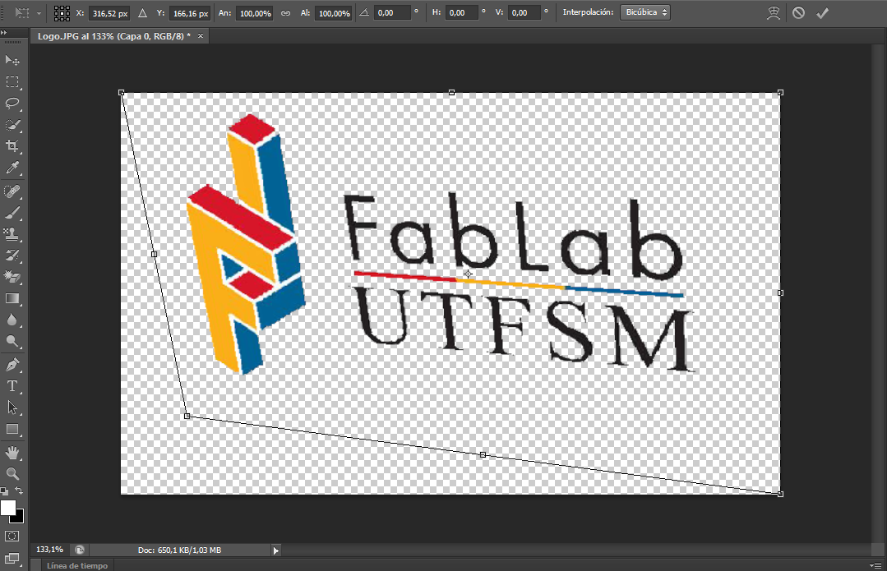

### Crear un patrón de imagenes

_Para crear un patrón de imágenes se utilizará la herramienta de motivo, que nos ayudara a estampar una imagen a través de la capa. Para crear una imagen patron primero se deben seleccionar las imagenes con las que se quiere realizar el patrón, para este caso y de modo que la explicación sea más sencilla solo se utilizará un recurso._  

  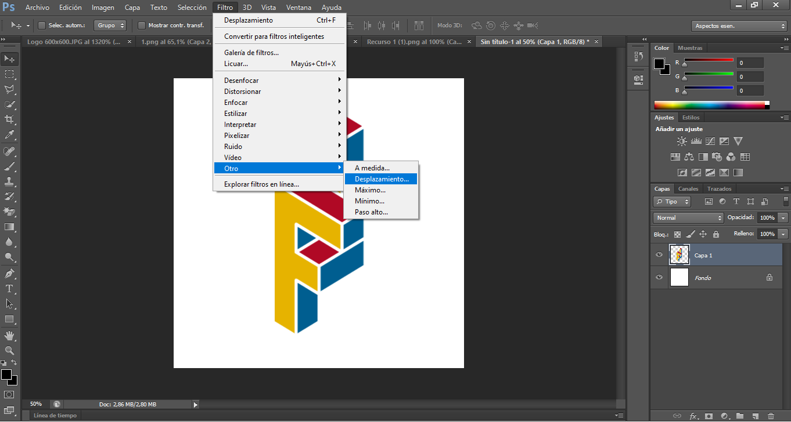

_Como se observa en la imagen lo primero es ubicar el recurso que queremos modificar en una capa, ir al menu desplegable de filtro, pinchar en la opción de otro y en desplazamiento. Seleccionada esa opción aparecerá un cuadro como el que se muestra en la imagen y que nos permitirá desplazar la imagen por el fondo hasta que quede seccionado, esto para que al repetir la imagen estas no tengan problema al conectarse._   

  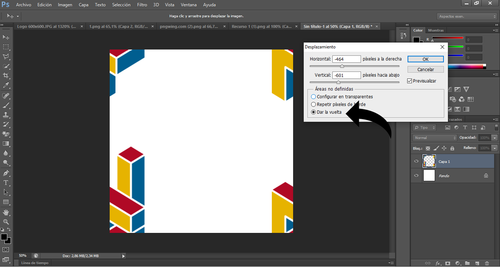

_Ya posicionada la imagen en los costados, se agrega un nuevo recurso ubicandolo en la poición que se requiera, en este caso al centro ya que será la parte principal de nuestro mosaico. Ya ubicada en el centro, se debe presionar el siguiente comando ctrl+alt+shift+E que nos servira para copiar todas las capas y enlazarlas, siendo esta capa la que transformaremos a un motivo_

  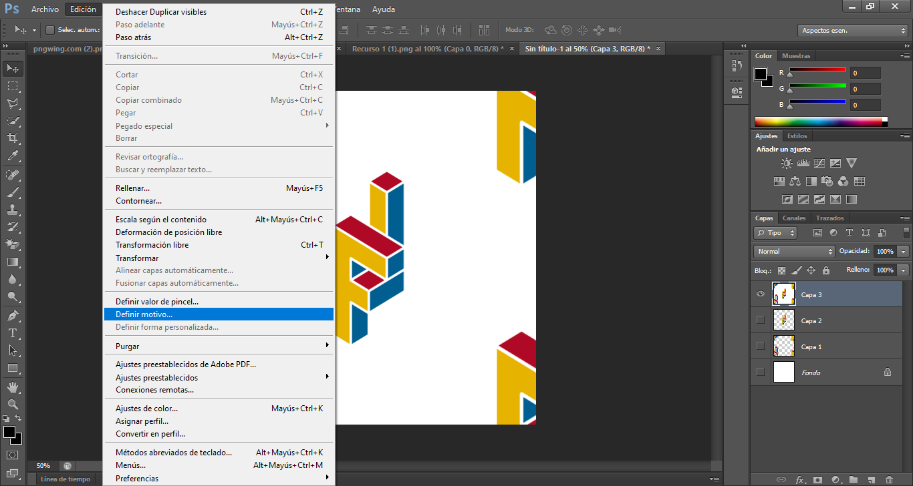

_Para transformar esta capa en motivo se debe seleccionar en primer lugar, ir al menú desplegable en edición y pinchar definir motivo, aqui se desplegara una ventana donde debemos dar nombre a este motivo. Finalmente para usarlo existen dos formas, la primera es a partir de la herramienta de motivo, para ello se debe crear un nuevo archivo, crear una capa nueva y sobre ella usar la herramienta tampon de motivo que se aplicara sobre la nueva capa igual que un pincel, como se puede observar en la imagen siguiente._ 

  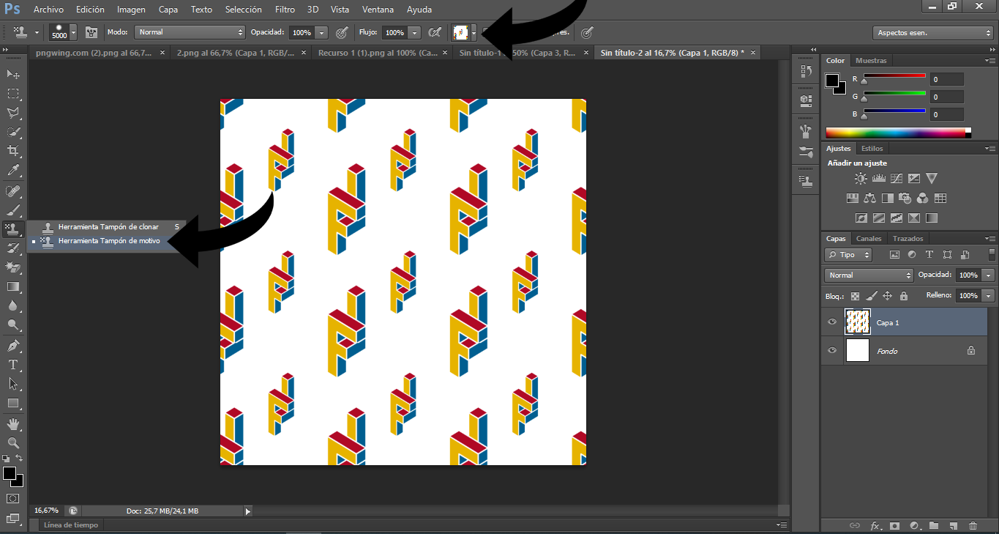
